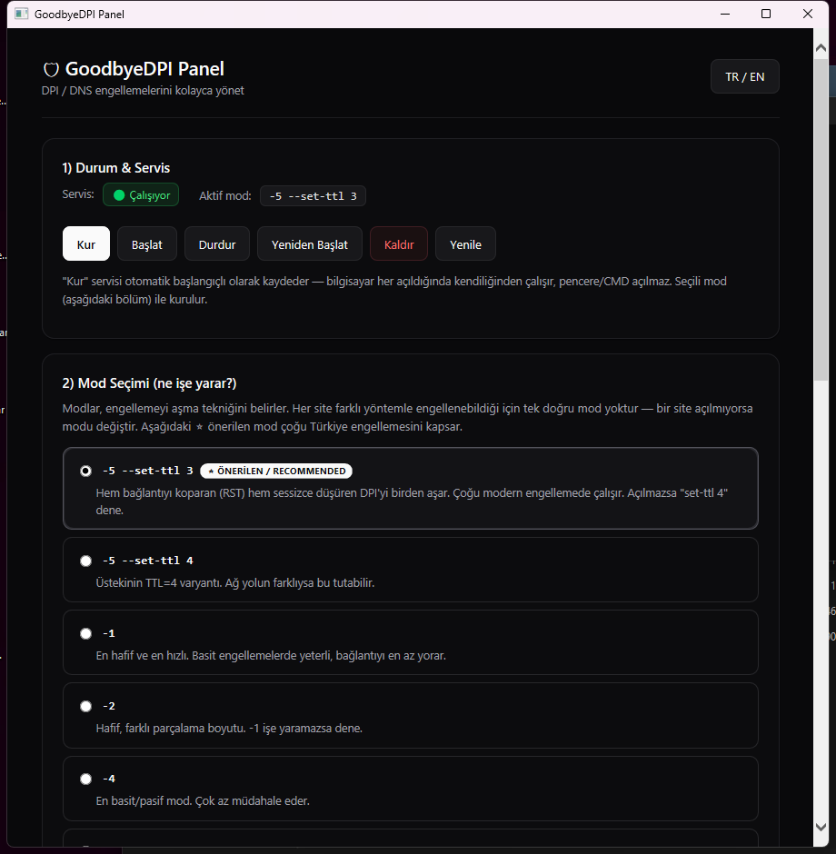

# 🛡️ GoodbyeDPI Panel

**Türkçe** | [English](#-english)



[GoodbyeDPI](https://github.com/ValdikSS/GoodbyeDPI) için, kullanımı **çok kolay** bir Windows kontrol paneli. DPI (Derin Paket İncelemesi) ve DNS engellemelerini aşmak için GoodbyeDPI'yi bir **Windows servisi** olarak kurar, ayarlarını tek bir pencereden yönetmeni sağlar. Tek dosya, kurulum gerektirmez.

> Yeni başlayanlar için sade ve anlaşılır arayüz — her ayarın ne işe yaradığı açıkça yazılır.

---

## ✨ Özellikler

- 🟢 **Servis yönetimi** — Tek tıkla Kur / Kaldır / Başlat / Durdur / Yeniden Başlat. Otomatik başlangıçla kurulur (bilgisayar açılınca sessizce çalışır, CMD penceresi açılmaz).
- 🎚️ **Açıklamalı mod seçici** — `-1`…`-9` ve `--set-ttl` seçenekleri, her birinin ne işe yaradığı açıklanmış. ⭐ Türkiye için önerilen hazır mod.
- 🪄 **Otomatik en iyi modu bul** — Açılmayan bir site yaz, panel modları tek tek deneyip o siteyi açan modu otomatik bulup uygular.
- 🔒 **DNS şifreleme (DoH)** — Tek anahtarla DNS-over-HTTPS aç/kapat (DNS tabanlı engellemeleri aşar).
- 🧪 **Site erişim testi** — Bir adres gir, DNS ve HTTPS bağlantısının çalışıp çalışmadığını gör.
- 🌍 **Çift dil** — Türkçe / İngilizce (tek düğmeyle değiştirilir).

---

## 📦 Kurulum

1. [GoodbyeDPI'nin son sürümünü](https://github.com/ValdikSS/GoodbyeDPI/releases) indir ve bir klasöre çıkar (içinde `goodbyedpi.exe` olmalı).
2. Bu depodaki **`GoodbyeDPI-Panel.hta`** ve **`Start-Panel.cmd`** dosyalarını **`goodbyedpi.exe` ile aynı klasöre** kopyala.
3. **`Start-Panel.cmd`**'ye çift tıkla → çıkan **UAC penceresine "Evet"** de.

> Panel yönetici yetkisiyle çalışmak zorundadır (servis ve DNS ayarlarını değiştirebilmek için). Bu yüzden açılışta bir kez UAC sorar.

Klasör şöyle görünmeli:

```
GoodbyeDPI\
├── goodbyedpi.exe
├── WinDivert.dll
├── WinDivert64.sys
├── GoodbyeDPI-Panel.hta   ← arayüz / the panel
├── Start-Panel.cmd        ← başlatıcı (buna çift tıkla) / launcher (double-click this)
├── install.cmd            ← (opsiyonel) komut satırından servis kurar / (optional) CLI install
└── uninstall.cmd          ← (opsiyonel) komut satırından servisi kaldırır / (optional) CLI uninstall
```

---

## 🚀 Hızlı Başlangıç

1. Paneli aç.
2. **DoH'u Aç** (DNS engellemeleri için).
3. Mod bölümünden ⭐ **`-5 --set-ttl 3`** seçili haldeyken **"Kur"**a bas.
4. Bir site hâlâ açılmıyorsa → **"Otomatik Bul & Uygula"** ile o site için doğru modu buldur.

---

## 🎚️ Modlar ne işe yarar?

Modlar, engellemeyi aşma **tekniğini** belirler. Her site farklı yöntemle engellenebildiği için tek doğru mod yoktur — bir site açılmıyorsa modu değiştir.

| Mod | Açıklama |
|-----|----------|
| ⭐ `-5 --set-ttl 3` | **Önerilen.** Hem bağlantıyı koparan (RST) hem sessizce düşüren DPI'yi birden aşar. Çalışmazsa `--set-ttl 4` dene. |
| `-1` | En hafif ve en hızlı. Basit engellemelerde yeterli. |
| `-2` | Hafif, farklı parçalama boyutu. |
| `-4` | En basit/pasif mod. |
| `-5` | Orta-güçlü. Modern DPI için iyi başlangıç. |
| `-6` | `-5`'in farklı varyantı (wrong-seq). |
| `-9` | En agresif/kombine. Zor durumlar için; bazı siteleri yavaşlatabilir. |

**`--set-ttl N`:** DPI'yi şaşırtmak için düşük TTL'li sahte paket gönderir; "sessiz düşürme" tekniğini aşmaya yarar. Çalışmazsa `3` ↔ `4` değiştir.

---

## 🧠 Bunlar ne demek?

- **DPI (Derin Paket İncelemesi):** İnternet sağlayıcın trafiğine bakıp hangi siteye gittiğini anlar ve engeller. GoodbyeDPI, bu incelemeyi şaşırtacak şekilde paketleri parçalar/değiştirir.
- **SNI engelleme:** HTTPS bağlanırken hangi siteye gittiğin (örn. `example.com`) açık yazılır. DPI bunu görüp ya bağlantıyı koparır (RST) ya da sessizce düşürür. GoodbyeDPI bu bilgiyi gizler.
- **DNS engelleme:** Site adının IP adresine çevrilmesi bozulur. **DoH (DNS-over-HTTPS)** sorguları şifreleyerek bunu aşar.

---

## 🩺 Sorun Giderme

- **Site hâlâ açılmıyor:** Önce **DoH'u aç**, sonra **Otomatik Bul** ile doğru modu buldur. Tarayıcıyı kapatıp aç.
- **Tarayıcı kendi DNS'ini kullanıyor:** Chrome/Edge'de `Ayarlar → Gizlilik → Güvenli DNS`'i kapat (sistem DoH'u zaten hallediyor).
- **Panel açılmıyor:** `.hta`'ya değil **`Start-Panel.cmd`**'ye çift tıkla ve UAC'ye "Evet" de.
- **Servisi tamamen kaldır:** Panelde **Kaldır**, veya yönetici komut isteminde: `sc stop GoodbyeDPI && sc delete GoodbyeDPI`.

---

## ⚠️ Yasal Uyarı

Bu araç bir **sansür aşma / ağ tanılama** aracıdır. Yalnızca **yasal içeriğe kişisel erişim** ve eğitim amaçlı kullan. Bulunduğun ülkenin yasalarına uymak senin sorumluluğundur. Yazar hiçbir sorumluluk kabul etmez.

---

## 🙏 Teşekkür & Lisans

- Asıl motor: **[GoodbyeDPI](https://github.com/ValdikSS/GoodbyeDPI)** — © ValdikSS, [WinDivert](https://github.com/basil00/Divert) tabanlı. GoodbyeDPI kendi lisansına (genellikle Apache 2.0 / ilgili lisanslar) tabidir; bu depo GoodbyeDPI'nin **kendisini içermez**, yalnızca panel arayüzünü sağlar.
- Bu panel: MIT Lisansı ile sunulur (aşağıya bak).

---
---

## 🇬🇧 English

[Türkçe](#️-goodbyedpi-panel) | **English**

A **dead-simple** Windows control panel for [GoodbyeDPI](https://github.com/ValdikSS/GoodbyeDPI). It installs GoodbyeDPI as a **Windows service** to bypass DPI (Deep Packet Inspection) and DNS-based blocking, and lets you manage everything from one window. Single file, no installation needed.

> Clean, beginner-friendly UI — every setting explains what it does.

### ✨ Features

- 🟢 **Service management** — One-click Install / Uninstall / Start / Stop / Restart. Installs with auto-start (runs silently on every boot, no CMD window).
- 🎚️ **Explained mode picker** — `-1`…`-9` and `--set-ttl`, each with a plain-language description. ⭐ A ready preset recommended for Turkey.
- 🪄 **Auto-find best mode** — Type a site that won't open; the panel tries each mode and auto-applies the one that works.
- 🔒 **Encrypted DNS (DoH)** — Toggle DNS-over-HTTPS with one switch (bypasses DNS-based blocking).
- 🧪 **Site access test** — Enter an address and see whether DNS and the HTTPS connection work.
- 🌍 **Bilingual** — Turkish / English (one-button toggle).

### 📦 Installation

1. Download the [latest GoodbyeDPI release](https://github.com/ValdikSS/GoodbyeDPI/releases) and extract it (must contain `goodbyedpi.exe`).
2. Copy **`GoodbyeDPI-Panel.hta`** and **`Start-Panel.cmd`** from this repo into the **same folder as `goodbyedpi.exe`**.
3. Double-click **`Start-Panel.cmd`** → click **"Yes"** on the UAC prompt.

> The panel must run elevated (to change service and DNS settings), so it asks for UAC once at startup.

### 🚀 Quick Start

1. Open the panel.
2. **Enable DoH** (for DNS blocking).
3. With ⭐ **`-5 --set-ttl 3`** selected, click **Install**.
4. If a site still won't open → use **Auto-Find & Apply** to detect the right mode for it.

### 🎚️ What do the modes do?

Modes set the bypass **technique**. Different sites are blocked differently, so there's no single right mode — if a site won't open, change the mode.

| Mode | Description |
|------|-------------|
| ⭐ `-5 --set-ttl 3` | **Recommended.** Bypasses both RST-injecting and silent-drop DPI at once. If it fails, try `--set-ttl 4`. |
| `-1` | Lightest and fastest. Enough for simple blocks. |
| `-2` | Light, different fragment size. |
| `-4` | Simplest/passive mode. |
| `-5` | Medium-strong. Good start for modern DPI. |
| `-6` | Variant of `-5` (wrong-seq). |
| `-9` | Most aggressive/combined. For hard cases; may slow some sites. |

**`--set-ttl N`:** Sends a fake low-TTL packet to confuse DPI; helps defeat the "silent drop" technique. If it doesn't work, switch between `3` ↔ `4`.

### 🧠 What does this mean?

- **DPI (Deep Packet Inspection):** Your ISP inspects traffic to detect and block which site you visit. GoodbyeDPI fragments/alters packets to confuse it.
- **SNI blocking:** During an HTTPS handshake the target name (e.g. `example.com`) is sent in clear text; DPI sees it and resets (RST) or silently drops the connection. GoodbyeDPI hides it.
- **DNS blocking:** Resolving a name to its IP is sabotaged. **DoH (DNS-over-HTTPS)** encrypts queries to bypass it.

### 🩺 Troubleshooting

- **Site still won't open:** Enable **DoH** first, then run **Auto-Find**. Restart your browser.
- **Browser uses its own DNS:** Disable `Settings → Privacy → Secure DNS` in Chrome/Edge (system DoH already handles it).
- **Panel won't open:** Double-click **`Start-Panel.cmd`** (not the `.hta`) and accept UAC.
- **Fully remove the service:** Click **Uninstall** in the panel, or in an admin prompt: `sc stop GoodbyeDPI && sc delete GoodbyeDPI`.

### ⚠️ Disclaimer

This is a **censorship-circumvention / network-diagnostic** tool. Use it only for **personal access to legal content** and educational purposes. Complying with your country's laws is your responsibility. The author assumes no liability.

### 🙏 Credits & License

- Core engine: **[GoodbyeDPI](https://github.com/ValdikSS/GoodbyeDPI)** © ValdikSS, built on [WinDivert](https://github.com/basil00/Divert). GoodbyeDPI is under its own license; this repo does **not** bundle GoodbyeDPI itself, only the panel UI.
- This panel: MIT License (see below).

---

## 📄 License (MIT)

```
MIT License

Copyright (c) 2026 Ali Karagöz

Permission is hereby granted, free of charge, to any person obtaining a copy
of this software and associated documentation files (the "Software"), to deal
in the Software without restriction, including without limitation the rights
to use, copy, modify, merge, publish, distribute, sublicense, and/or sell
copies of the Software, and to permit persons to whom the Software is
furnished to do so, subject to the following conditions:

The above copyright notice and this permission notice shall be included in all
copies or substantial portions of the Software.

THE SOFTWARE IS PROVIDED "AS IS", WITHOUT WARRANTY OF ANY KIND, EXPRESS OR
IMPLIED, INCLUDING BUT NOT LIMITED TO THE WARRANTIES OF MERCHANTABILITY,
FITNESS FOR A PARTICULAR PURPOSE AND NONINFRINGEMENT. IN NO EVENT SHALL THE
AUTHORS OR COPYRIGHT HOLDERS BE LIABLE FOR ANY CLAIM, DAMAGES OR OTHER
LIABILITY, WHETHER IN AN ACTION OF CONTRACT, TORT OR OTHERWISE, ARISING FROM,
OUT OF OR IN CONNECTION WITH THE SOFTWARE OR THE USE OR OTHER DEALINGS IN THE
SOFTWARE.
```
